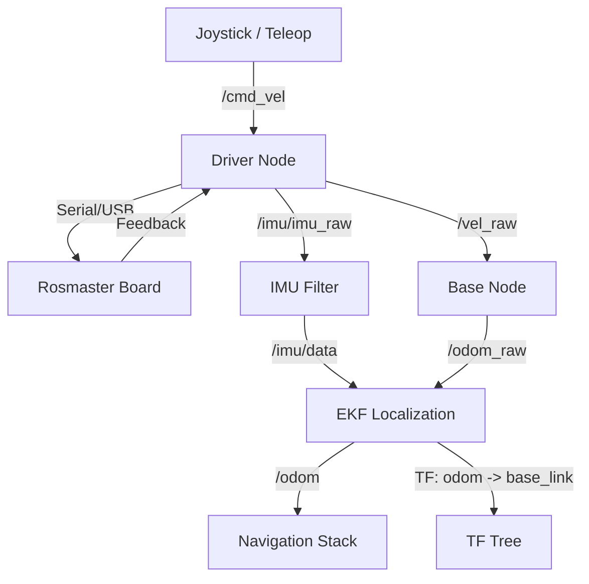

# Chassis Architecture - Yahboom ROSMASTER X3 Plus

This document provides a detailed overview of the chassis control and localization architecture for the Yahboom ROSMASTER X3 Plus robot in ROS2 Humble.

## Overview

The X3 Plus is a mecanum-wheel robot equipped with a 6-DOF robotic arm. Its chassis control system follows a standard ROS2 pattern:
1. **Joystick/Teleop** nodes publish velocity commands.
2. **Driver node** communicates with hardware and publishes raw sensor data.
3. **Base node** calculates raw wheel odometry.
4. **Localization stack** (EKF) fuses sensor data for stable odometry.

## Component Breakdown

### 1. Hardware Interface (`yahboomcar_bringup`)
- **Node:** `driver_node` (`Mcnamu_driver_X3plus`)
- **Executable:** `yahboomcar_bringup/Mcnamu_X3plus.py`
- **Responsibilities:**
    - Communicates with the Rosmaster board via serial/USB.
    - Subscribes to `/cmd_vel` for movement.
    - Publishes:
        - `/vel_raw` (Twist): Raw motion feedback from the board.
        - `/imu/imu_raw` (Imu): Raw accelerometer/gyro data.
        - `/mag/mag_raw` (MagneticField): Raw magnetometer data.
        - `/voltage` (Float32): Battery voltage.
        - `/joint_states` (JointState): Arm joint positions for TF.

### 2. Odometry Calculation (`yahboomcar_base_node`)
- **Node:** `base_node` (`base_node_X3`)
- **Executable:** `yahboomcar_base_node/base_node_X3` (C++)
- **Responsibilities:**
    - Subscribes to `/vel_raw`.
    - Integrates linear (x, y) and angular (z) velocities over time.
    - Publishes:
        - `/odom_raw` (Odometry): Calculated wheel odometry.
    - Optional: Broadcasts `odom` -> `base_footprint` transform (disabled by default in EKF setup).

### 3. Localization & Fusion (`yahboomcar_bringup`)
- **Nodes:**
    - `imu_filter_madgwick`: Filters raw IMU data.
        - Subscribes: `/imu/imu_raw`
        - Publishes: `/imu/data`
    - `ekf_filter_node` (`robot_localization`): Fuses wheel odometry and IMU.
        - Subscribes: `/odom_raw`, `/imu/data`
        - Publishes: `/odom` (fused odometry) and `odom` -> `base_link` transform.

### 4. Control Interface (`yahboomcar_ctrl`)
- **Node:** `yahboom_joy` (`yahboom_joy_X3plus`)
- **Executable:** `yahboomcar_ctrl/yahboom_joy_X3plus.py`
- **Responsibilities:**
    - Processes joystick input from `joy_node`.
    - Implements safety features (R2 trigger must be held to enable movement).
    - Publishes `/cmd_vel` for the chassis and `/TargetAngle` for the arm.

## Topic & Data Flow

## Frame Hierarchy (TF)

1. `odom` (Map-relative ground frame)
2. `base_footprint` (Ground projection of robot center)
3. `base_link` (Physical center of the robot)
4. `imu_link` (IMU sensor frame)
5. `laser_link` / `laser` (LIDAR sensor frame)
6. `camera_link` (RGB-D camera frame)
7. `arm_link1-5` & `grip_joint` (Robotic arm frames)

## Navigation Modes (`yahboomcar_nav`)

- **LIDAR-only:** Uses RPLidar `/scan` for Gmapping or Cartographer.
- **Visual SLAM:** Uses RGB-D camera + LIDAR for RTAB-Map SLAM.
- **Nav2 Planners:** Supports DWA (Dynamic Window Approach) and TEB (Timed Elastic Band) for local planning.

## Recent Changes & Maintenance

### Mecanum Y-Velocity Fix (Feb 2026)
- **Problem:** The `base_node_X3` was hardcoded to zero out `linear.y` velocity in the `/odom_raw` message, which prevented the EKF from accurately tracking side-to-side (strafing) movements on mecanum robots.
- **Fix:** Restored `odom.twist.twist.linear.y = linear_velocity_y_;` in `src/yahboomcar_base_node/src/base_node_X3.cpp`.
- **Impact:** Improved localization accuracy during complex maneuvers.

### X3 Plus Support in Navigation Launch
- **Change:** Updated `yahboomcar_nav` launch files (`laser_bringup_launch.py` and `laser_bringup_no_odom_launch.py`) to recognize `x3plus` as a valid `robot_type`.
- **Configuration:** When `robot_type:=x3plus` is passed, it now correctly includes `yahboomcar_bringup_X3plus_launch.py` from the `yahboomcar_bringup` package.
