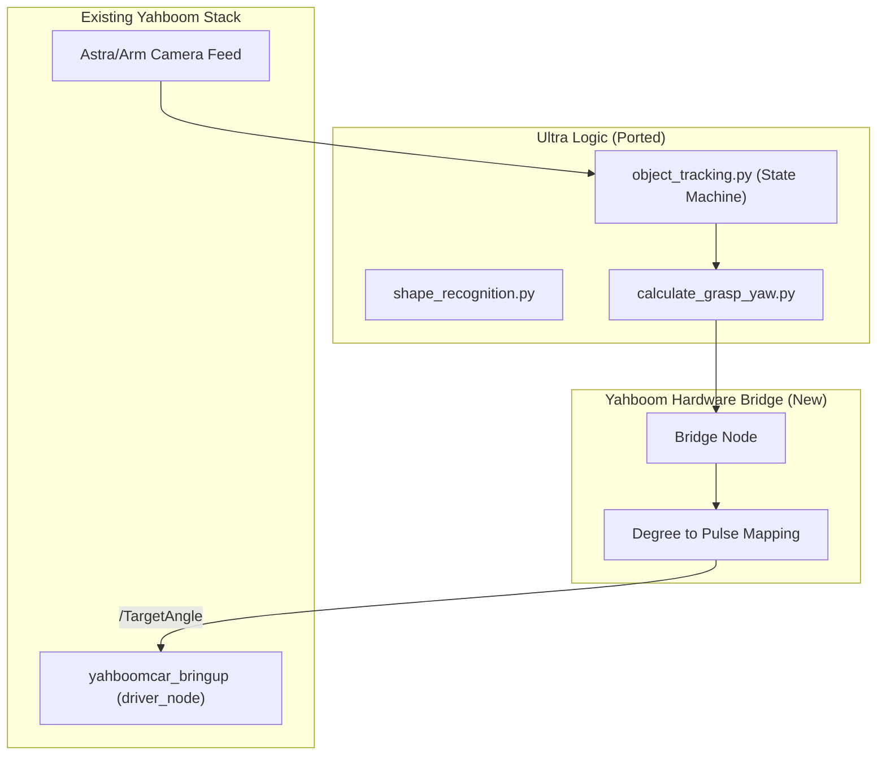

# Yahboom ROSMASTER X3Plus Object Tracking Enhancement Plan

## Updated Plan Overview
- **Strategy:** "Logic Migration" (threaded queues, LAB color, geometric logic) while using existing Yahboom drivers.
- **Phase 1: Baseline Testing.** Perform tests on current Yahboom nodes (`arm_autopilot`, `KCFTracker`, `arm_color_transport`, `person_tracker_node`) using the mandatory sourcing rule.
- **Phase 2: Selective Migration.** Port high-value components only if Phase 1 reveals performance or accuracy gaps.

## Overview

This plan outlines a two-phase approach to enhance the object tracking and manipulation capabilities of the Yahboom ROSMASTER X3Plus by selectively incorporating high-value logic from the ArmPi Ultra codebase.

## Strategy and Feedback

The approach of "migrating logic, not the entire stack" is the only practical way forward. Rebuilding the Ultra's lower-level drivers (servos, firmware-specific kinematics) on the X3Plus would fail because the hardware abstraction layers are fundamentally different.

### Core Strategy

1. **Phase 1: Baseline Testing.** Execute existing Yahboom tracking nodes (`arm_autopilot`, `yahboomcar_astra`, `person_tracker_node`) to identify performance bottlenecks or accuracy issues.
2. **Phase 2: Modular Integration.** If Phase 1 reveals issues, selectively port high-value logic from the ArmPi Ultra into a new `yahboomcar_app` package.

### New Addition: YOLO11 Person Tracker

A YOLOv11-based person tracker has been developed using Ultralytics with TensorRT acceleration:
- **Node:** `person_tracker_node` (yahboomcar_visual package)
- **Messages:** `TrackedPerson.msg`, `TrackedPersons.msg` (yahboomcar_msgs)
- **Features:** Persistent person tracking with unique IDs, bounding boxes, confidence scores
- **Topics:** Publishes `/person_tracker/tracked_persons` and `/person_tracker/annotated_image`

## ROS2 Environment Setup Rule
Whenever running terminal commands related to ROS2 (like `colcon build`, `ros2 launch`, `ros2 run`, etc.), the following sourcing steps MUST be followed:
1. Navigate to `/root/yahboomcar_ros2_ws_new/yahboomcar_ws`.
2. Source the global ROS2 Humble setup: `source /opt/ros/humble/setup.bash`.
3. Source the local workspace setup: `source install/setup.bash`.

## Migration Analysis

### 1. High-Value Logic to Migrate

The following components from the Ultra are superior to the current Yahboom implementations and should be ported:

- **Decoupled Image Processing:** The threaded queue system in `object_tracking.py` will significantly reduce lag on the Jetson Orin/Nano.
- **Shape Recognition Geometric Logic:** Use depth data (`height_std`, `CornerNum`) to identify cuboids, spheres, and cylinders (from `shape_recognition.py`).
- **Intelligent Grasping:** The logic in `calculate_grasp_yaw.py` that determines how to orient the gripper relative to an object's long edge.
- **LAB Color Space:** Porting the color detection to use LAB (from the Ultra) instead of HSV (Yahboom) will make tracking more robust to shadows and bright lights.

### 2. Adaptation Challenges

- **Arm Control:** The Ultra publishes `ServosPosition` (array of raw pulse values). The X3Plus expects `yahboomcar_msgs/ArmJoint` (angles in degrees). We will create a "Hardware Bridge" class to handle this conversion.
- **Kinematics:** The Ultra uses a custom `.so` (shared object) for Inverse Kinematics. Since we cannot use that binary on the X3Plus, we will rely on the X3Plus's existing `yahboomcar_ctrl` or simple geometric IK mappings for the 6DOF arm.
- **Coordinate Frames:** The "World Coordinates" in the Ultra scripts are relative to its own base. We will need to re-calibrate these for the X3Plus chassis height and arm reach.

## Architecture

## Detailed Execution Plan

### Phase 1: Performance Testing

-   **Step 1.1:** Run `arm_autopilot` and measure frame lag and tracking jitter.
-   **Step 1.2:** Test `KCFTracker` for chassis following persistence and recovery.
-   **Step 1.3:** Run `arm_color_transport` to evaluate the success rate of simple pick-and-place.
-   **Step 1.4:** Test `person_tracker_node` (YOLO11) for FPS, tracking persistence, and ID consistency across occlusions.
-   **Step 1.5:** Document specific failure points (e.g., "lost red object in bright light" or "arm movements are jerky", "person tracker loses ID after occlusion").

### Phase 2: Modular Migration (Triggered by Phase 1 findings)

#### Step 1: Package Foundation

-   **Step 1.1:** Create `yahboomcar_ws/src/yahboomcar_app` as a standard ROS2 Python package.
-   **Step 1.2:** Bring over the `sdk/` utilities (`pid.py`, `fps.py`, `common.py`) and place them in a local directory within the new package.
-   **Step 1.3:** Clean up the imports in these files to point to the new package structure.

#### Step 2: The "Hardware Bridge"

-   **Step 2.1:** Develop a utility class that replaces the Ultra's `set_servo_position` with a wrapper for the Yahboom `TargetAngle` publisher.
-   **Step 2.2:** Map the Ultra's 6-joint indices to the X3Plus's arm configuration (Joint 1-6 mapping).

#### Step 3: Feature Migration (One-by-One)

-   **Step 3.1: Object Tracking:** Port `object_tracking.py` logic, focusing on the threaded image processing and state machine. Replace face-tracking parts with placeholders.
-   **Step 3.2: Color Tracker:** Port the LAB-based color detection from `color_tracker.py` for improved lighting robustness.
-   **Step 3.3: Grasp & Sorting:** Port the orientation-aware pick-and-place logic (`object_sorting.py` and `grasp.py`).
-   **Step 3.4: Shape Recognition:** Implement the geometric detection (spheres, cubes, cylinders) using the Astra depth feed.
-   **Step 3.5: Waste Classification:** Port the classification logic from `waste_classification.py`.

## References

- Source Code: `/root/yahboomcar_ros2_ws_new/yahboomcar_ws/ArmPi_Ultra_app/`
- Current Guide: `/root/yahboomcar_ros2_ws_new/yahboomcar_ws/docs/Object_Tracking/PERSISTENT_TRACKING_TEST_GUIDE.md`